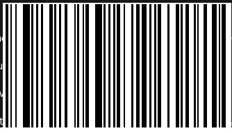

# barcode-detection-and-decoding

<p> The whole process can be divided into two processes:<br>
  &nbsp;&nbsp;&nbsp;&nbsp;&nbsp;1. <ins><b>Barcode Detection</b></ins> : The process of detecting barcode from an image can be termed as Object Detection. In this case, object detection
  is &nbsp;&nbsp;&nbsp;&nbsp;&nbsp;&nbsp;&nbsp;&nbsp;&nbsp;&nbsp;done using YOLOv5.
  <br>
  <div align="center">
  
  </div>
  
  ```
  Example of barcode detection
  ```
  
  <br>
  
  &nbsp;&nbsp;&nbsp;&nbsp;&nbsp;2. <ins><b>Barcode Detection</b></ins> : Once the barcode is detected, we crop the image and extract the ROI(region of interest) and convert RGB image 
  &nbsp;&nbsp;&nbsp;&nbsp;&nbsp;&nbsp;&nbsp;&nbsp;&nbsp;&nbsp;to BGR image
 
 
   <div align="center">
  
  </div>
  
```
Example of cropped image
```

&nbsp;&nbsp;&nbsp;&nbsp;&nbsp;3. <ins><b>Decoding Information</b></ins> : An external library pyzbar is used to extract the information stored in barcode

```
[
  Decoded(data=b'2007002006212', type='EAN13', rect=Rect(left=99, top=83, width=93, height=48), 
  polygon=[Point(x=99, y=83), Point(x=99, y=131), Point(x=192, y=130), Point(x=192, y=110)], 
  quality=35, orientation='UP')
]
```
